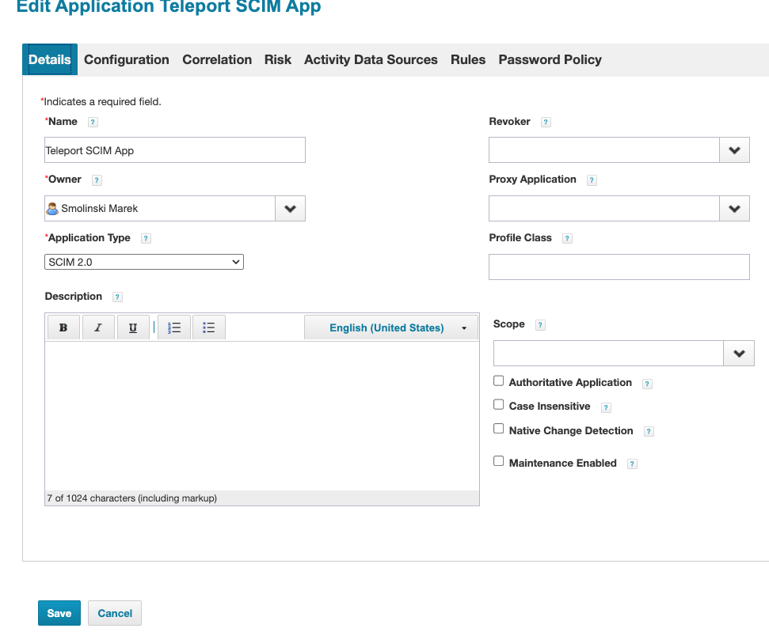
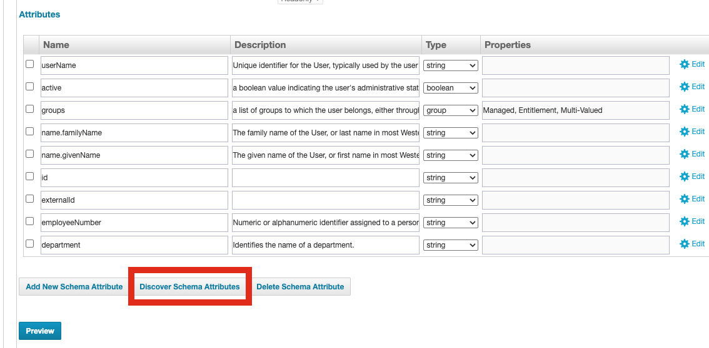
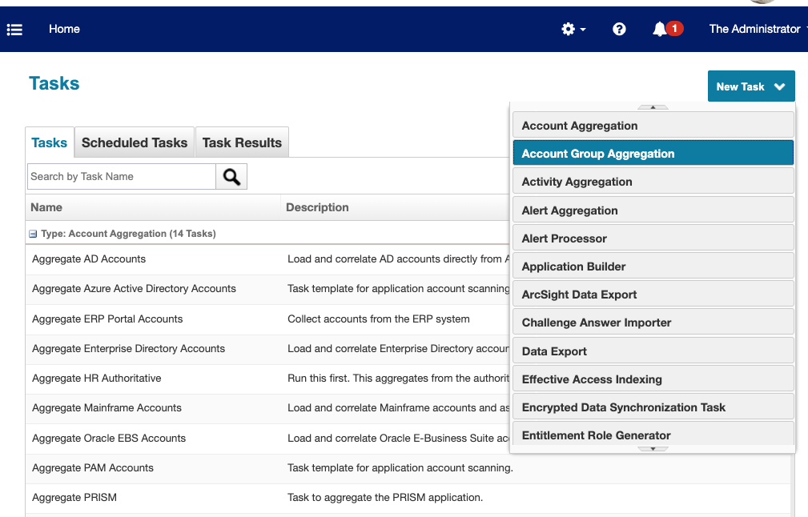

The SCIM integration between **SailPoint** and **Teleport** enables automated
synchronization of SailPoint group memberships and
Teleport Access Lists. This integration supports centralized identity governance in
SailPoint while Teleport enforces fine-grained access controls.

User permissions in Teleport are defined through Access Lists. While role definitions
live in Teleport, group membership is dynamically managed by SailPoint SCIM group
assignments. This ensures users have up-to-date access aligned with organizational
policies.

## How it works

The SCIM integration uses a 1:1 mapping between SailPoint Application group entitlement and Teleport
Access Lists:

- Each SailPoint Application group entitlement `displayName` must match the `spec.title` of a Teleport
Access List.
- Access Lists of SCIM type must be created in advance in Teleport. In this guide we're creating them using Terraform.
- Role assignments are handled in Teleport, while group membership is managed by
SailPoint.

## Prerequisites
- Teleport Enterprise v(=teleport.version=)
- Teleport Terraform provider v(=teleport.version=)
- A running Teleport cluster with SSO enabled (e.g. Okta SAML connector)
- Access to SailPoint IdentityNow or IdentityIQ


## Step 1/4. Configure SCIM Integration
Teleport provides a guided web UI based configuration flow for SCIM integration.

In the Teleport Web UI, go to **"Add new integration"** and select **SCIM**.


Select the **SAML connector** to associate SCIM-provisioned users with SSO logins.

- By default, SSO users in Teleport are ephemeral.
- SCIM provisioning ensures users are persistently created and managed by
 SailPoint.


Click **Continue** to proceed to the **SCIM Credentials** screen.

- Teleport uses OAuth 2.0 Bearer Tokens for SCIM authentication.
- Copy the **Client ID**, **Client Secret**, and **Base URL** — you'll use them
 when configuring SailPoint.

## Step 2/4: Create a SCIM-Managed Access List in Teleport

Create a new Access List in Teleport using Terraform. Be sure to set `type = "scim"`
and match `spec.title` to the name of a SailPoint entitlement group this list should be synced to:


```hcl
resource "teleport_access_list" "acl-group-requester" {
  header = {
    version = "v1"
    name = "scim-group-requester"
  }
  spec = {
    title = "GroupRequester"
    type = "scim"
    grants = {
      roles  = ["requester"]
      traits = []
    }
    owners = [
      {
        name = "alice"
      }
    ]
    membership_requires = {
      roles = []
    }
    ownership_requires = {
      roles = []
    }
    audit = {
      recurrence = {
        frequency    = 3
        day_of_month = 15
      }
    }
  }
}
```

<Admonition type="info">
    The SCIM group name (displayName) in SailPoint must exactly match
    `spec.title` in the Teleport Access List.
</Admonition>


## Step 3/4: Configure SCIM 2.0 Teleport Connector in SailPoint

To integrate Teleport with SailPoint using SCIM, you need to configure a SCIM connector in SailPoint IdentityNow or SailPoint IdentityIQ.
The exact configuration steps may vary slightly depending on your version of SailPoint, but the general process is as follows:

### Configure SCIM in SailPoint

Go to **Applications > Application Definition > Add New Application**.
Select **SCIM 2.0** as the application type and provide the required configuration details.
Create a new SCIM connector in SailPoint at: Applications > Application Definition > Add New Application.
Select **SCIM 2.0** as the application type and provide the required configuration details:



Set the **Base URL** and provided by Teleport under **Configuration -> Settings**.
Set the Authentication Type to OAuth 2.0 with the Grant Type set to **Client Credentials**.
Copy Client ID and Client Secret from the saved Teleport SCIM configuration settings.
Click **Test Connection** to verify that the connection is successful:


### Configure SCIM schema discovery

Under  **Configuration -> Schema**, click **Discover Schema Attributes** on both the **Accounts** and **Groups** tabs to retrieve the schema attributes:


Go to the **Provisioning Policy** section, and create a **Create Policy** that maps the `userName` SCIM attribute to the user’s email address:

Save all changes.

#### Configure SCIM Group Aggregation in SailPoint

Navigate to **Setup > Tasks -> New Task -> Group Aggregation**.

Select the **Teleport SCIM Connector**, then click **Save and Execute** to run the aggregation task.

If the aggregation completes successfully,
you should see the imported Access Lists from Teleport in SailPoint under: **Applications > Entitlement Catalog**


## Step 4/4: Submit Access Requests to Sailpoint ACL Group Entitlement (Optional)

Go to Manage > Manage User Access > Manage User Access.
Submit an access request for a mapped Access List (as represented by a group
entitlement in SailPoint).

Once the request is approved, the user will be added to the appropriate Access List in Teleport.
