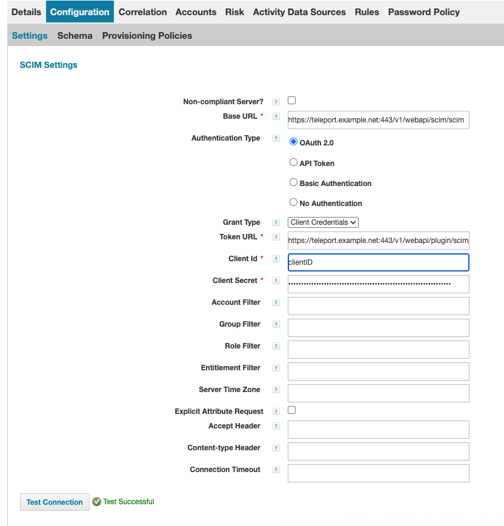
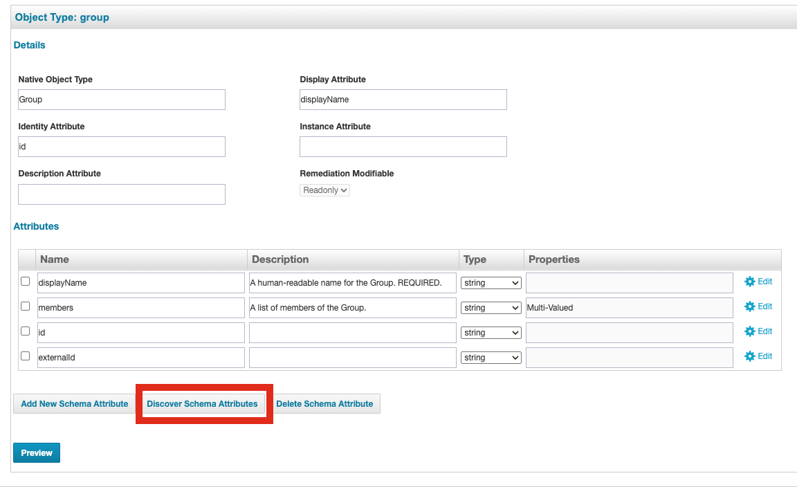

The SCIM integration between **SailPoint** and **Teleport** enables automated
synchronizing SailPoint group memberships with
Teleport Access Lists. This integration supports centralized identity governance in
SailPoint while Teleport enforces fine-grained access controls.

User permissions in Teleport are defined through Access Lists. While role definitions
live in Teleport, **group membership is dynamically managed** by SailPoint SCIM group
assignments. This ensures users have up-to-date access aligned with organizational
policies.

## Prerequisites
- Teleport Enterprise v(=teleport.version=)
- Teleport Terraform provider v(=teleport.version=)
- A running Teleport cluster with SSO connect (e.g., Okta SAML enabled
- Access to SailPoint IdentityNow or IdentityIQ


### How it works

The SCIM integration uses a **1:1 mapping** between SailPoint groups and Teleport
Access Lists:

- Each SailPoint group’s `displayName` must match the `spec.title` of a Teleport
  Access List.
- Access Lists must be created in advance in Teleport and set to `type: "scim"`.
- Role assignments are handled in Teleport, while group membership is managed by
  SailPoint.


### Step 1/3. Configure SCIM Integration
Teleport provides a guided web UI based configuration flow for SCIM integration.

1. In the Teleport Web UI, go to **"Add new integration"** and select **SCIM**.


   


2. Select the **SAML connector** to associate SCIM-provisioned users with SSO logins.

   - By default, SSO users in Teleport are ephemeral.
   - SCIM provisioning ensures users are persistently created and managed by
     SailPoint.

   


3. Click **Continue** to proceed to the **SCIM Credentials** screen.

   - Teleport uses OAuth 2.0 Bearer Tokens for SCIM authentication.
   - Copy the **Client ID**, **Client Secret**, and **Base URL** — you'll use them
     when configuring SailPoint.

## Step 2/3: Create a SCIM-Managed Access List in Teleport

Create a new Access List in Teleport using Terraform. Be sure to set `type = "scim"`
and match `spec.title` to the SailPoint group name:


```hlc
resource "teleport_access_list" "acl-group-editor" {
  header = {
    version = "v1"
    name = "scim-group-editor"
    metadata = {
      labels = {
        scim = "sailpoint"
      }
    }
  }
  spec = {
    title = "GroupEditor"
    type = "scim"
    grants = {
      roles  = ["editor"]
      traits = []
    }
    owners = [
      {
        name = "alice"
      }
    ]
    membership_requires = {
      roles = []
    }
    ownership_requires = {
      roles = []
    }
    audit = {
      recurrence = {
        frequency    = 3
        day_of_month = 15
      }
    }
  }
}
```


<Admonition type="info">
    The SCIM group name (displayName) in SailPoint must exactly match
    spec.title in the Teleport Access List.
</Admonition>


### Step 3/4: Configure SCIM 2.0 Teleport Connector in SailPoint

To integrate Teleport with SailPoint using SCIM, you need to configure a SCIM connector in SailPoint IdentityNow or SailPoint IdentityIQ.
The exact configuration steps may vary slightly depending on your version of SailPoint, but the general process is as follows:

1. Configure SCIM in SailPoint

   1. Go to **Applications > Application Definition > Add New Application**.

   2. Select **SCIM 2.0** as the application type and provide the required configuration details.

   3. Create a new SCIM connector in SailPoint at: Applications > Application Definition > Add New Application.

   4. Select **SCIM 2.0** as the application type and provide the required configuration details:

      

   5. Set the **Base URL** and provided by Teleport under **Configuration -> Settings**.

   6. Set the Authentication Type to OAuth 2.0 with the Grant Type set to **Client Credentials**.

   7. Copy Client ID and Client Secret from the saved Teleport SCIM configuration settings.

   8. Click **Test Connection** to verify that the connection is successful.

      

2. Configure Discover the SCIM Schema:

   1. Under  **Configuration -> Schema**, click **Discover Schema Attributes** on both the **Accounts** and **Groups** tabs to retrieve the schema attributes.

      
      

   2. Go to the **Provisioning Policy** section, and create a **Create Policy** that maps the `userName` SCIM attribute to the user’s email address.

      

   3. Save all changes.

3. Configure SCIM Group Aggregation in SailPoint:
   1. Navigate to **Setup > Tasks -> New Task -> Group Aggregation**.

      

   2. Select the **Teleport SCIM Connector**, then click **Save and Execute** to run the aggregation task.

      

      If the aggregation completes successfully,
      you should see the imported Access Lists from Teleport in SailPoint under: **Applications > Entitlement Catalog**

      

### Step 4/5: Submit Access Requests to Teleport Group Entitle (Optional)

    1. Go to Manage > Manage User Access > Manage User Access.
    2. Submit an access request for a mapped Access List (as represented by a group
    entitlement in SailPoint).

    

Once the request is approved, the user will be added to the appropriate Access List in Teleport.
