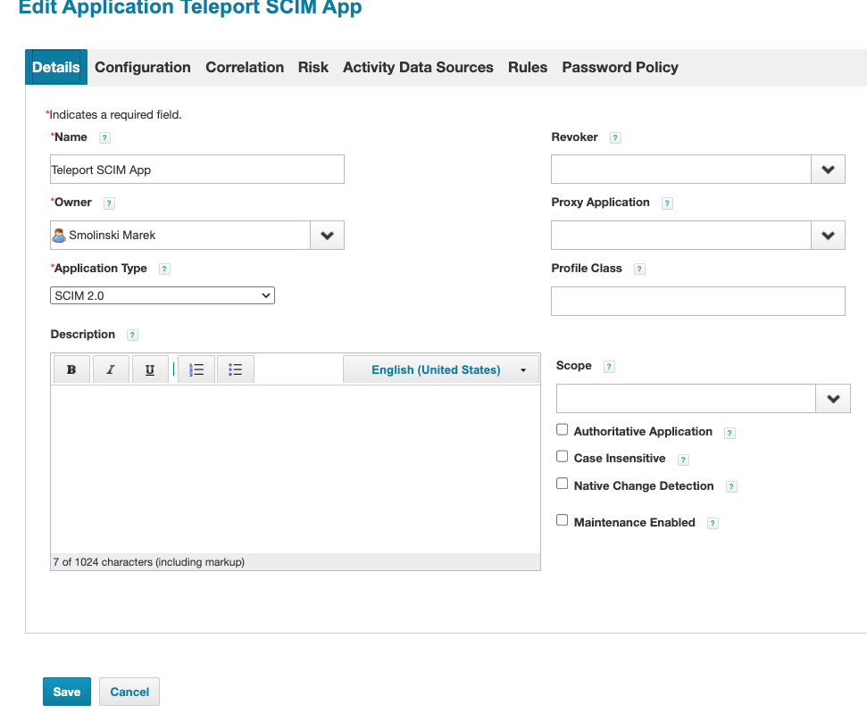
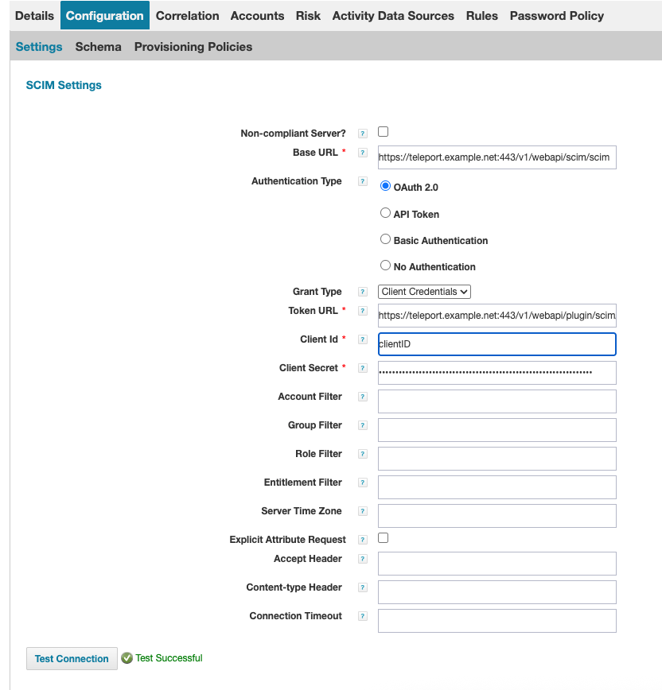
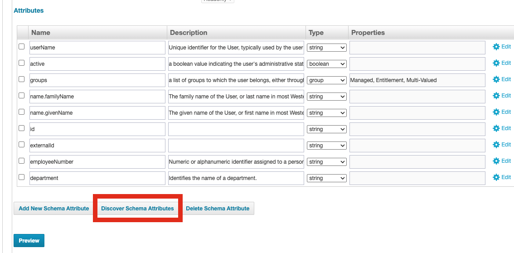
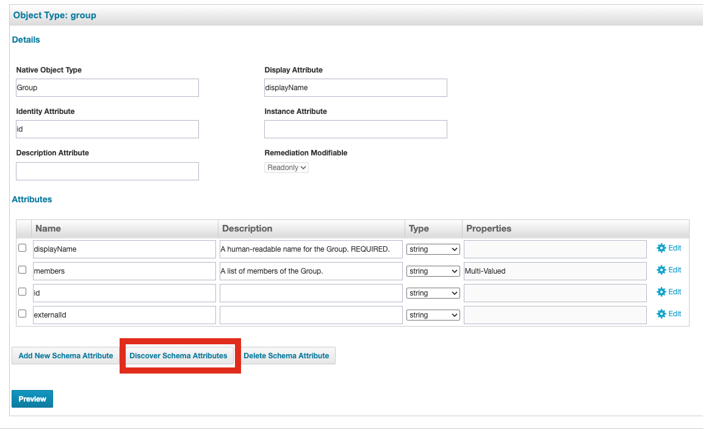
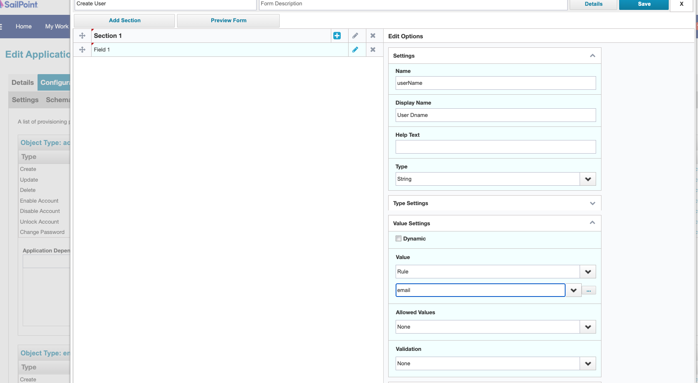
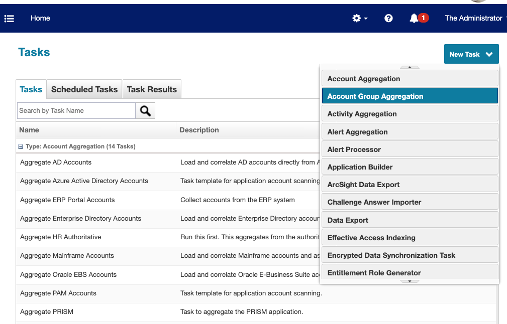
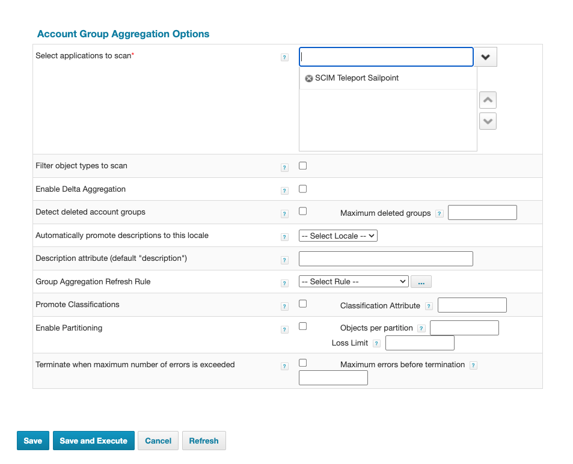
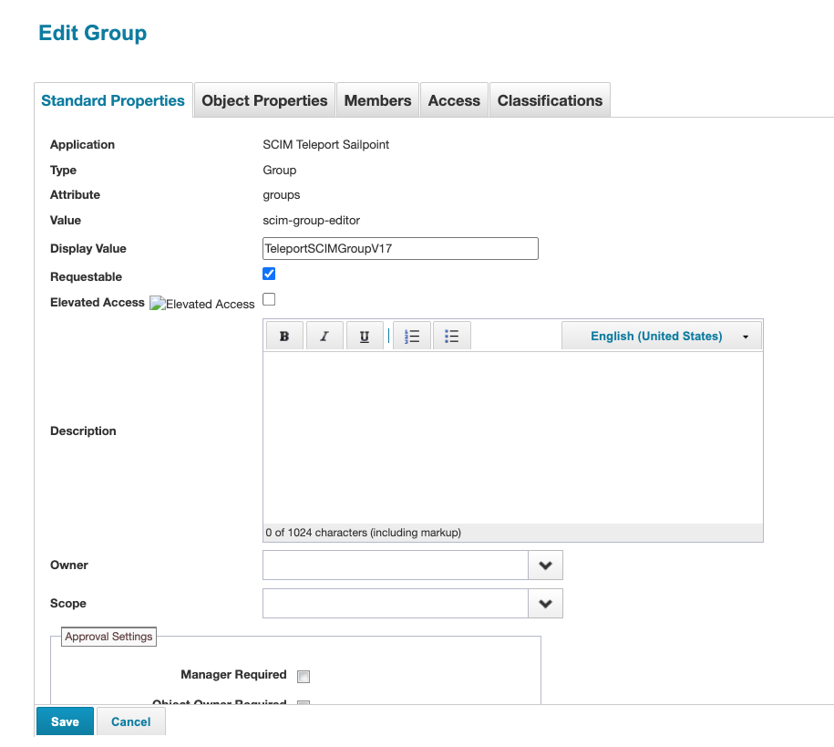
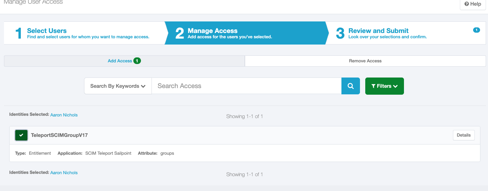

## Step 1/2: Configure SCIM 2.0 Teleport Connector in SailPoint

To integrate Teleport with SailPoint using SCIM, you need to configure a SCIM connector in SailPoint IdentityNow or SailPoint IdentityIQ.
The exact configuration steps may vary slightly depending on your version of SailPoint, but the general process is as follows:

### Configure SCIM in SailPoint

Go to **Applications > Application Definition > Add New Application**.
Select **SCIM 2.0** as the application type and provide the required configuration details.
Create a new SCIM connector in SailPoint at: Applications > Application Definition > Add New Application.
Select **SCIM 2.0** as the application type and provide the required configuration details:

Set the **Base URL** and provided by Teleport under **Configuration -> Settings**.
Set the Authentication Type to OAuth 2.0 with the Grant Type set to **Client Credentials**.
Copy Client ID and Client Secret from the saved Teleport SCIM configuration settings.
Click **Test Connection** to verify that the connection is successful:

### Configure Discover the SCIM Schema

Under  **Configuration -> Schema**, click **Discover Schema Attributes** on both the **Accounts** and **Groups** tabs to retrieve the schema attributes:

Go to the **Provisioning Policy** section, and create a **Create Policy** that maps the `userName` SCIM attribute to the user’s email address:

Save all changes.

#### Configure SCIM Group Aggregation in SailPoint

Navigate to **Setup > Tasks -> New Task -> Group Aggregation**.

Select the **Teleport SCIM Connector**, then click **Save and Execute** to run the aggregation task.

If the aggregation completes successfully,
you should see the imported Access Lists from Teleport in SailPoint under: **Applications > Entitlement Catalog**

## Step 2/2: Submit Access Requests in Sailpoint Group Entitlement representing Access List (Optional)

Go to Manage > Manage User Access > Manage User Access.
Submit an Access Request for a mapped Access List (as represented by a group
entitlement in SailPoint).

Once the request is approved, the user will be added to the appropriate Access List in Teleport.
